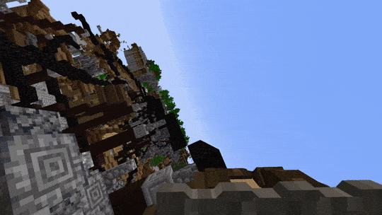
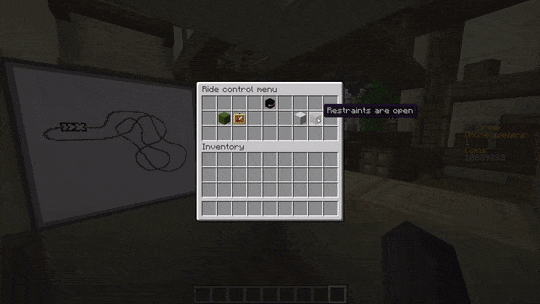

# **jrides** - Brings your coasters to your Minecraft server!
'jrides' is an open-source rollercoaster animator for Minecraft Spigot. Super-smoothly animated coasters within the snap of a finger. 

**No mods required!**

## 🎢 *Ride - go inside your own rides*
* With jrides, you can enter any ride you create. Whether it is a launched, inverted or water coaster.

## 🎛️ *Control - send your friends onto the lifthill*
* Be the person behind the buttons! You decide whether the ride is safe for dispatch or not. 
* Not interested in being behind the controls, or no player online to control the ride? No problem! Put the ride in automatic mode!

**And with the advanced ride monitoring system, you know where all trains are, without even seeing them!**

## 😵‍💫 *SmoothCoasters - Go upside down!*
With built-in support for the [smooth-coasters client](https://www.curseforge.com/minecraft/mc-mods/smoothcoasters), you can go upside down! 

## **Download**

Click one of the versions below to start your download! Thank you and enjoy!

Version | Link
--- | ---
1.19.2 | <>

## Visit out live demo!
Try it out for yourself! Join our demo server at [server.greekcraft.nl](https://greekcraft.nl).

*Created by MeneerPinguin*

---
