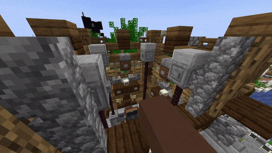
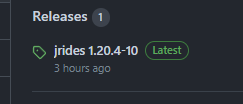

# **jrides** - Bring coasters to your Minecraft server!
 

'jrides' is an open-source rollercoaster animator for Minecraft Spigot. Super-smoothly animated coasters within the snap of a finger. 

✨ **No mods required!** ✨

## 🎢 *Ride - go inside your own rides*
* With jrides, you can enter any ride you create. Whether it is a launched, inverted or water coaster.

## 🎛️ *Control - send your friends onto the lift-hill*
* Be the person behind the buttons! You decide whether the ride is safe for dispatch or not. 
* Not interested in being behind the controls, or no player online to control the ride? No problem! Put the ride in automatic mode!

**And with the advanced ride monitoring system, you know where all trains are, without even seeing them!**

## 🚠 *Go sideways - hyper-mobile transfers*
* Besides going forward, your coaster can go sideways, if you want! Use transfers to push a train sideways, upwards, or even roll it on its side.

## 😵‍💫 *SmoothCoasters - upside down POV camera*
With built-in support for the [smooth-coasters client](https://www.curseforge.com/minecraft/mc-mods/smoothcoasters), you can go upside down! 

## ✨ And so much more!
* Custom **Flat rides** - i.e. TeaCups, Caroussels, Ferris Wheels, anything that rotates!
* Animated Flat Rides using **Blender**!
* Flat Ride passenger controls (move your own cart)
* Navigation menu
* Ride counters
* Double stations
* Multi-track support, redirect your trains left or right
* Player teleportation system

---

## Download

Download the latest version on GitHub (latest release tag on the right)

*(Example)*

### Warning - jrides is currently in beta. Please report any issues in GitHub.

## Configuration

Want to get started?

Refer to [docs/config.md](./docs/config.md) for all the latest documentation.

---

## 🎡 **Visit our live demo!** server.greekcraft.nl
Try it out for yourself! Join our demo server at [server.greekcraft.nl](https://greekcraft.nl).

 

**Trailer video**

---

*jrides - created by [MeneerPinguin](https://github.com/JVerbruggen)*
